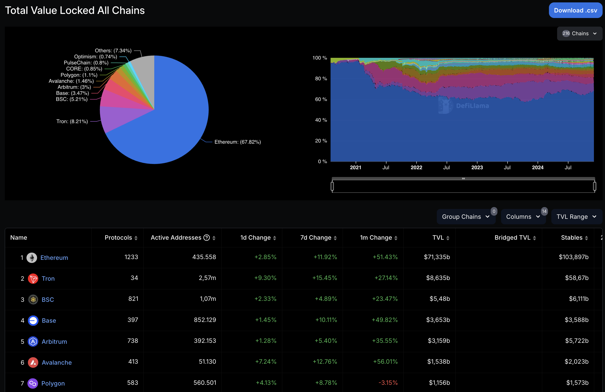
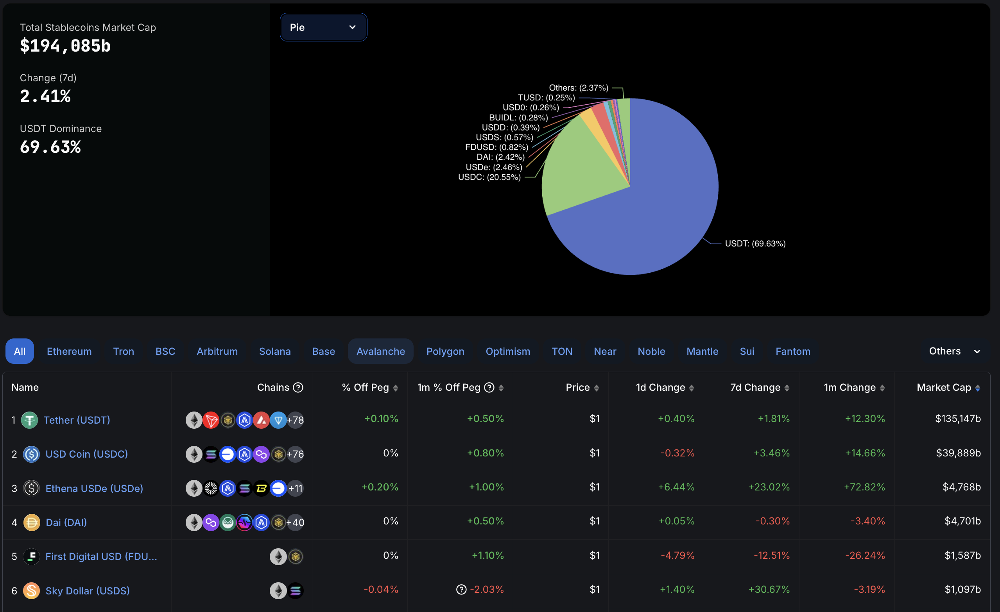
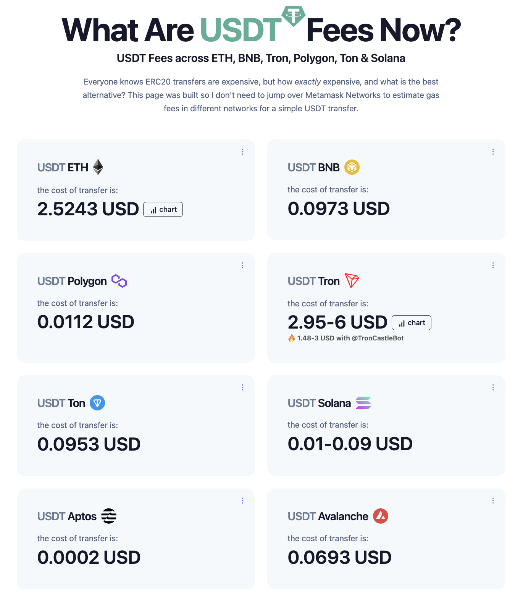

# JewelChain

Bienvenido a **JewelChain**, un sistema de trazabilidad para la industria de la joyería diseñado para garantizar la transparencia y confianza a lo largo de toda la cadena de valor. Desde la extracción de materiales hasta la venta final al cliente, JewelChain utiliza tecnología blockchain para registrar y verificar cada etapa del proceso, asegurando autenticidad, sostenibilidad y una experiencia confiable para los usuarios.

Puedes explorar la demo en la landing page:  
[https://jewelchain.vercel.app/](https://jewelchain.vercel.app/)

---

## 🎯 Propósito del Proyecto

En la industria de la joyería, la autenticidad y el origen ético de los materiales son aspectos críticos. Sin embargo, los procesos actuales carecen de transparencia, lo que dificulta la verificación del origen de los materiales y los pasos intermedios. 

**JewelChain** aborda estos problemas al ofrecer:
- **Trazabilidad completa**: Desde la extracción de materias primas hasta la venta al cliente.
- **Garantía de autenticidad**: Cada etapa se registra de manera inmutable en la blockchain.
- **Cumplimiento ético**: Transparencia en la procedencia de los materiales para apoyar prácticas sostenibles.
- **Confianza del cliente**: Los clientes pueden verificar el recorrido de su joya desde el origen.

---

## 🛠️ ¿Cómo Funciona el Sistema?

El sistema consta de las siguientes etapas:
1. **Extracción de Material**: Registro de materiales en el sistema.
2. **Distribución a la Fábrica**: Seguimiento del transporte de materiales hasta las instalaciones de fabricación.
3. **Fabricación de Joyería**: Producción de joyas y registro de detalles en la blockchain.
4. **Distribución a la Tienda**: Seguimiento de las joyas desde el fabricante hasta los puntos de venta.
5. **Venta al Cliente Final**: Verificación del recorrido de la joya por parte del cliente.

Todos los eventos son registrados mediante **smart contracts**, lo que garantiza la inmutabilidad y transparencia de los datos.

---

## 🌟 Demo Interactiva

Prueba la demo directamente desde la landing page:  
[https://jewelchain.vercel.app/](https://jewelchain.vercel.app/)

### Usuarios por Defecto para la Demo

Puedes usar los siguientes usuarios para interactuar con las funcionalidades de la demo:

#### Roles disponibles (usuarios anvil):
- **Minero**  
  **Address**: `0xf39Fd6e51aad88F6F4ce6aB8827279cffFb92266`  
  **Private Key**: `0xac0974bec39a17e36ba4a6b4d238ff944bacb478cbed5efcae784d7bf4f2ff80`

- **Fabricante**  
  **Address**: `0x70997970C51812dc3A010C7d01b50e0d17dc79C8`  
  **Private Key**: `0x59c6995e998f97a5a0044966f0945389dc9e86dae88c7a8412f4603b6b78690d`

- **Distribuidor**  
  **Address**: `0x3C44CdDdB6a900fa2b585dd299e03d12FA4293BC`  
  **Private Key**: `0x5de4111afa1a4b94908f83103eb1f1706367c2e68ca870fc3fb9a804cdab365a`

- **Admin**  
  **Address**: `0xa0Ee7A142d267C1f36714E4a8F75612F20a79720`  
  **Private Key**: `0x2a871d0798f97d79848a013d4936a73bf4cc922c825d33c1cf7073dff6d409c6`

---

## 📄 Documentación Adicional

- **Smart Contracts**  
  Detalles sobre los contratos inteligentes que respaldan la trazabilidad de las joyas.  
  [Accede al README de Blockchain](https://github.com/codecrypto-academy/pfm-web3-nov24-3/tree/main/blockchain)  

- **Frontend**  
  Explicación sobre la implementación del frontend y cómo interactúa con los smart contracts.  
  [Accede al README del Frontend](https://github.com/codecrypto-academy/pfm-web3-nov24-3/tree/main/frontend)

---

## 🧑‍💻 Tecnologías Utilizadas

- **Blockchain**: Red Polygon para trazabilidad inmutable.
- **Frontend**: Next.js con TypeScript, desplegado en Vercel.  

---

## 🌐 ¿Por qué Elegimos la Red Polygon?

Al diseñar **JewelChain**, realizamos un análisis detallado para identificar la blockchain más adecuada para desplegar nuestros contratos inteligentes. Este análisis se basó en dos requisitos principales:

1. **Compatibilidad con EVM (Ethereum Virtual Machine):**  
   Esto asegura que nuestros contratos sean interoperables y puedan aprovechar herramientas existentes en el ecosistema Ethereum.

2. **Uso de Stablecoins ERC-20:**  
   Las stablecoins como USDT y USDC son esenciales para mantener la estabilidad en las transacciones dentro de la plataforma.

### Análisis Comparativo

- **Redes EVM:**  
   Utilizamos DefiLlama para filtrar blockchains compatibles con EVM. Ethereum destaca por su gran volumen total bloqueado (TVL), lo que indica su popularidad y confianza. Sin embargo, el alto costo por transacción en Ethereum representa un desafío para proyectos como el nuestro.
   

- **Uso de Stablecoins:**  
   Analizamos las stablecoins dominantes en el mercado, donde USDT y USDC tienen una posición predominante. Dado que cualquier transacción en JewelChain implica potencialmente una compra/venta, es crucial elegir una red que facilite su uso.
   

- **Costos de Transacción:**  
   Las tarifas por transacción son un factor crítico para la adopción del sistema. Revisamos los datos de GasFeesNow y encontramos que Polygon ofrece costos de transacción significativamente más bajos, con un promedio de **0.004 USD por transacción**, frente a los **hasta 7 USD** que puede costar en Ethereum debido a la volatilidad del mercado.
   

### Decisión Final

Elegimos la red **Polygon** debido a su:
- Compatibilidad total con EVM.
- Bajos costos de transacción, haciéndola accesible para los usuarios finales.
- Uso eficiente de stablecoins como USDT y USDC.

Polygon combina la robustez de Ethereum con una eficiencia de costos superior, lo que la convierte en la mejor opción para un proyecto centrado en la trazabilidad y transacciones confiables.

